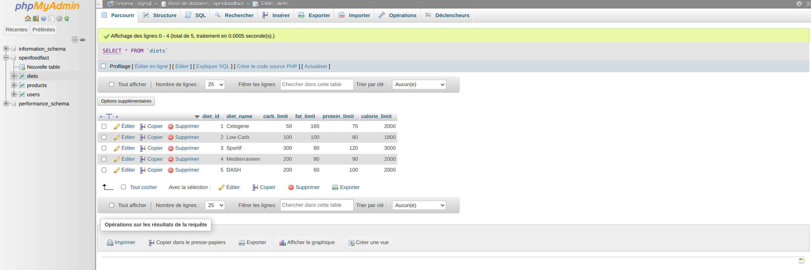
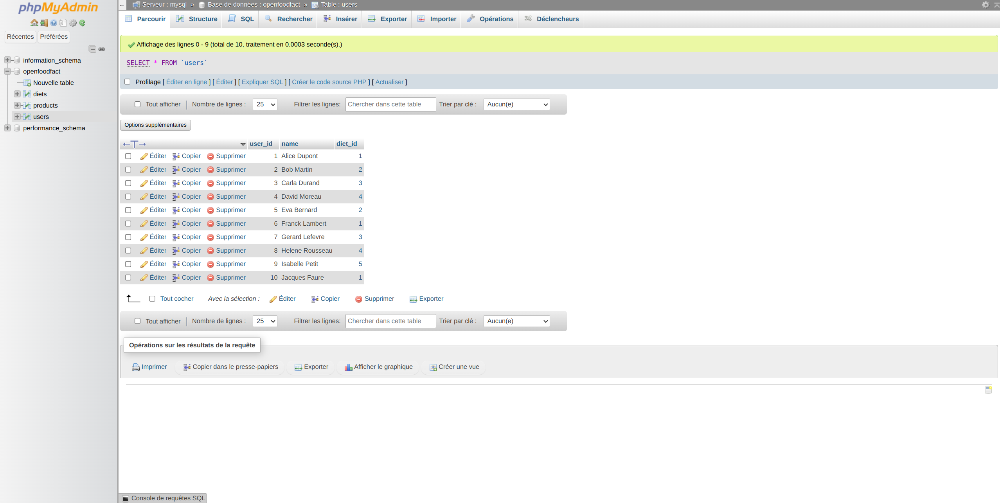
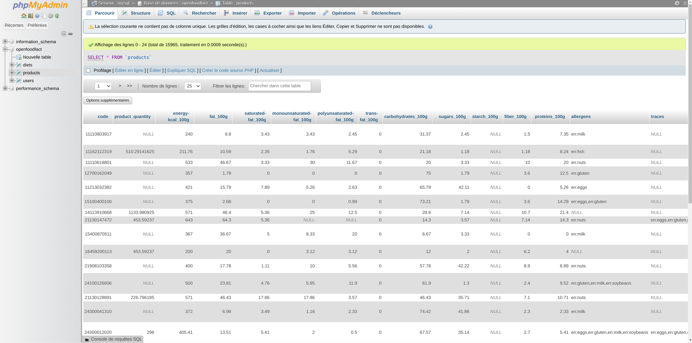
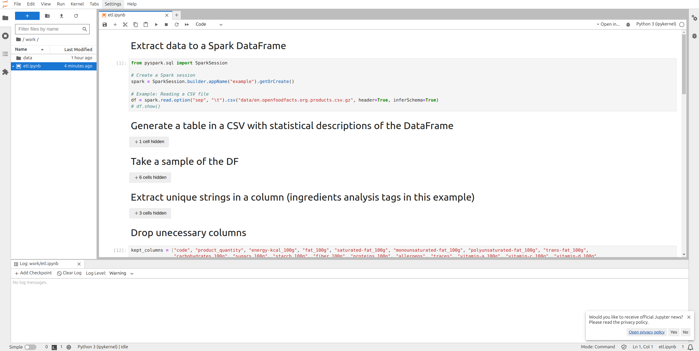

# Projet OpenFoodFacts EISI1 Capgemini

Résultat du TP de la matière "Intégration des données" réalisé par BERNARD Félix, TEPEDELEN Léo, BARBIN Kévin

## Consignes d'éxécutions
* Effectuer un gitclone `https://github.com/bambouzelle/openfoodfact.git`
* Télécharger le jeu de donnée [openfoodfact](https://fr.openfoodfacts.org/data) au format csv.gz (celui de 900mo)
* Le déplacer dans le répertoire : `work/data/`
* Se positionner dans le répertoire `openfoodfact/`
* Effectuer un `docker-compose up` (ou `sudo docker compose up` sous linux) avec votre invite de commande
* Aller sur `http://localhost:8888/` et copier le token (que vous pourrez trouver dans les logs de votre invite de commande) puis le coller pour accéder à jupyter notebook ou cliquez sur le lien qui apparaît dans le terminal
* Aller dans le répertoire `work/` et double-cliquer sur etl.ipynb
* Lancer la totalité du notebook en cliquant sur les deux flèche en haut (fastforward) et, cliquer sur `restart` au pop-up et patienter 
(Si il y a un `*` à côté du bloc de code cela indique que l'étape est en cours. Si il y a un nombre, cela indique que l'étape a été réalisé.)
* Si vous souhaitez visualiser la base de donnée vous pouvez aller sur `http://localhost:8080/` pour accéder à phpmyadmin
* En plus des tables `diets` et `users` vous devriez désormais voir une table `products` si tout s'est déroulé avec succès

## Résultat Final

